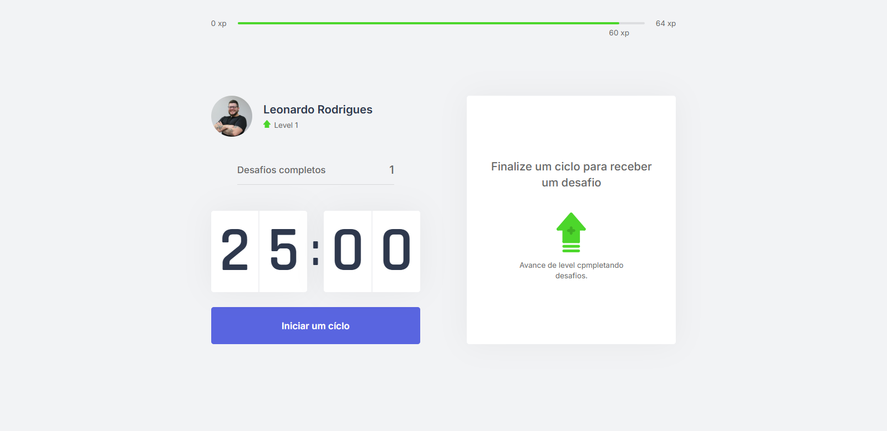
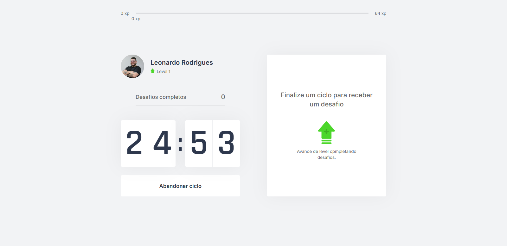
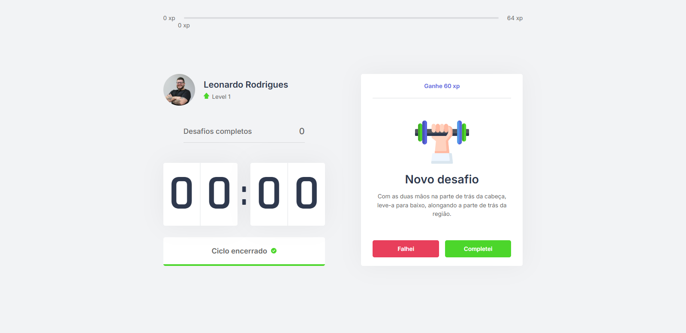

# 🍅 Pomo - Aplicação Pomodoro com Gamificação

Uma aplicação web inspirada na técnica Pomodoro que combina produtividade com exercícios físicos e cuidados com a saúde, desenvolvida com Next.js e TypeScript.
<!-- link do projeto -->
<!-- https://pomo-puce.vercel.app/ -->

## 📸 Screenshots

<div align="center">
  
  <p><em>Home com timer, status do jogador, level e desafio</em></p>

  
  <p><em>Desafio ativo</em></p>

  
  <p><em>Fim do tempo</em></p>
  
</div>

## 🔗 Acesso ao Projeto

Você pode acessar o projeto através do link: [Pomo](https://pomo-puce.vercel.app/)


## 📋 Sobre o Projeto

O Pomo é uma aplicação que implementa a técnica Pomodoro (25 minutos de foco + 5 minutos de pausa) com um sistema de gamificação. Durante as pausas, o usuário recebe desafios de exercícios físicos e para os olhos, ganhando experiência (XP) ao completá-los e subindo de nível.

### ✨ Funcionalidades Implementadas

- ⏱️ **Timer Pomodoro**: Countdown de 25 minutos para sessões de foco
- 🎯 **Sistema de Desafios**: Exercícios físicos e para os olhos durante as pausas
- 🎮 **Gamificação**: Sistema de XP, níveis e conquistas
- 🔔 **Notificações**: Alertas sonoros e do navegador
- 💾 **Persistência**: Dados salvos em cookies para manter progresso
- 📱 **Interface Responsiva**: Design moderno e intuitivo

## 🛠️ Tecnologias Utilizadas

- **Framework**: Next.js 14
- **Linguagem**: TypeScript
- **Estilização**: CSS Modules
- **Gerenciamento de Estado**: React Context API
- **Cookies**: js-cookie
- **Áudio**: Web Audio API
- **Notificações**: Notification API

## 📁 Estrutura do Projeto

```
moveit-next/
├── public/
│   ├── icons/           # Ícones da aplicação
│   │   ├── favicon.png      # Favicon
│   │   ├── logo-full.svg    # Logo completo
│   │   └── notification.mp3 # Som de notificação
│   ├── src/
│   │   ├── components/      # Componentes React
│   │   │   ├── ChallengeBox.tsx
│   │   │   ├── CompletedChallenges.tsx
│   │   │   ├── Countdown.tsx
│   │   │   ├── ExperienceBar.tsx
│   │   │   ├── LevelUpModal.tsx
│   │   │   └── Profile.tsx
│   │   ├── contexts/        # Contextos React
│   │   │   ├── ChallengesContext.tsx
│   │   │   └── CountdownContext.tsx
│   │   ├── pages/           # Páginas Next.js
│   │   │   ├── _app.tsx
│   │   │   ├── _document.tsx
│   │   │   └── index.tsx
│   │   └── styles/          # Estilos CSS Modules
│   │       ├── components/
│   │       ├── pages/
│   │       └── global.css
│   ├── challenges.json      # Base de dados dos desafios
│   ├── package.json
│   └── tsconfig.json
```

## 🎯 Componentes Principais

### 🏆 ChallengesContext
- Gerencia o sistema de níveis, XP e desafios
- Controla o modal de level up
- Persiste dados em cookies
- Integra com a Notification API

### ⏰ CountdownContext
- Controla o timer de 25 minutos
- Gerencia estados do countdown (ativo, pausado, finalizado)
- Integra com o sistema de desafios

### 📊 Componentes de Interface
- **ExperienceBar**: Barra de progresso de XP
- **Profile**: Informações do usuário e nível atual
- **Countdown**: Timer visual do Pomodoro
- **ChallengeBox**: Exibe desafios ativos
- **CompletedChallenges**: Contador de desafios completados
- **LevelUpModal**: Modal de celebração de novo nível

## 🎮 Sistema de Desafios

A aplicação possui 12 desafios divididos em duas categorias:

### 💪 Exercícios Corporais (9 desafios)
- Alongamentos para braços, pescoço e pernas
- Exercícios de flexibilidade
- Movimentos para alívio da tensão

### 👁️ Exercícios para os Olhos (3 desafios)
- Descanso visual
- Exercícios de foco
- Massagem relaxante

Cada desafio possui:
- **Tipo**: `body` ou `eye`
- **Descrição**: Instruções detalhadas
- **XP**: Pontos de experiência (50-140 XP)

## 🚀 Como Executar

### Pré-requisitos
- Node.js (versão 18 ou superior)
- npm ou yarn

### Instalação
```bash
# Clone o repositório
git clone <url-do-repositorio>

# Entre no diretório
cd moveit-next

# Instale as dependências
npm install

# Execute em modo de desenvolvimento
npm run dev
```

A aplicação estará disponível em `http://localhost:3000`

### Scripts Disponíveis
```bash
npm run dev    # Executa em modo desenvolvimento
npm run build  # Gera build de produção
npm run start  # Executa build de produção
```

## 🔧 Melhorias Sugeridas

### 🎨 Interface e UX
- [ ] **Dark Mode**: Implementar tema escuro
- [ ] **Animações**: Adicionar micro-interações e transições suaves
- [ ] **Responsividade**: Melhorar layout para dispositivos móveis
- [ ] **Acessibilidade**: Implementar ARIA labels e navegação por teclado
- [ ] **PWA**: Transformar em Progressive Web App

### ⚡ Funcionalidades
- [ ] **Configurações Personalizáveis**:
  - Duração do timer (15, 25, 45 minutos)
  - Volume das notificações
  - Tipos de desafios preferidos
- [ ] **Estatísticas Avançadas**:
  - Gráficos de produtividade
  - Histórico de sessões
  - Streak de dias consecutivos
- [ ] **Sistema Social**:
  - Ranking entre usuários
  - Compartilhamento de conquistas
  - Desafios em grupo

### 🗄️ Dados e Performance
- [ ] **Banco de Dados**: Migrar de cookies para banco de dados
- [ ] **Autenticação**: Sistema de login/registro
- [ ] **API**: Criar API REST para gerenciar dados
- [ ] **Cache**: Implementar estratégias de cache
- [ ] **SEO**: Melhorar otimização para motores de busca

### 🧪 Qualidade de Código
- [ ] **Testes**: Implementar testes unitários e de integração
- [ ] **ESLint/Prettier**: Configurar linting e formatação
- [ ] **Storybook**: Documentar componentes
- [ ] **CI/CD**: Pipeline de integração contínua
- [ ] **Error Boundary**: Tratamento de erros React

### 🎯 Novos Recursos
- [ ] **Múltiplos Perfis**: Suporte a diferentes usuários
- [ ] **Integração com Calendário**: Sincronização com Google Calendar
- [ ] **Relatórios**: Exportação de dados de produtividade
- [ ] **Gamificação Avançada**:
  - Badges e conquistas
  - Sistema de recompensas
  - Desafios semanais/mensais

### 🔧 Melhorias Técnicas
- [ ] **TypeScript Strict**: Ativar modo strict
- [ ] **Bundle Analysis**: Otimizar tamanho do bundle
- [ ] **Performance**: Implementar lazy loading
- [ ] **Monitoring**: Adicionar analytics e error tracking
- [ ] **Docker**: Containerização da aplicação

## 🐛 Problemas Conhecidos

1. **Bug no getServerSideProps**: Propriedade `challengeCompleted` com nome incorreto
2. **Notificação**: Construtor da Notification API com sintaxe incorreta
3. **TypeScript**: Configuração não está em modo strict
4. **Acessibilidade**: Falta de labels e navegação por teclado

## 📄 Licença

Este projeto está sob a licença MIT. Veja o arquivo [LICENSE](LICENSE) para mais detalhes.

## 🤝 Contribuição

Contribuições são bem-vindas! Sinta-se à vontade para:

1. Fazer fork do projeto
2. Criar uma branch para sua feature (`git checkout -b feature/AmazingFeature`)
3. Commit suas mudanças (`git commit -m 'Add some AmazingFeature'`)
4. Push para a branch (`git push origin feature/AmazingFeature`)
5. Abrir um Pull Request

---

**Desenvolvido com ❤️ e ☕ durante sessões de Pomodoro** 